# Flow hero: AI workflow

UI/UX design intern assignment: a desktop landing page hero for **Flow**, a fictional productivity app.

- **Tagline (from the brief):** "Everything you need to get your work done, without the noise."
- **Primary CTA (from the brief):** Get Started
- **Tools:** Claude Code (a cloud session working directly in this repository), the ThreeUI *Dimensional Field* WebGL background, and Playwright screenshots so each iteration could be checked visually.

## Final result

| | |
|---|---|
| Final desktop hero |  |
| Same build on a phone | 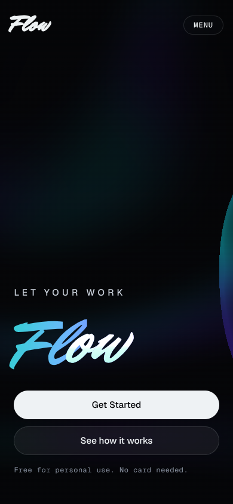 |

- Run locally: `npm install`, then `npm run dev`.
- Main code: `src/components/FlowHero.tsx`, `src/components/FlowHero.css` and `src/components/SiteHeader.tsx`.

## How the work went, step by step

### 1. Choosing the background and getting its real source

I chose ThreeUI's **Dimensional Field**: glass spheres over slow cyan and violet light beams. I wanted the original effect, not a lookalike, so I gave Claude the source and told it not to approximate it.

- Claude first refused to rebuild the effect from a description and asked for the source.
- When the source link was blocked by the session's network settings, it stopped and reported that, rather than guessing.
- After I pasted the source, it checked each file against the SHA-256 hashes ThreeUI publishes:
  - The stylesheet matched exactly.
  - Two files didn't match, because whitespace was lost in the paste. Claude recorded this openly and added `npm run verify:sources` so any later change to these files is caught.

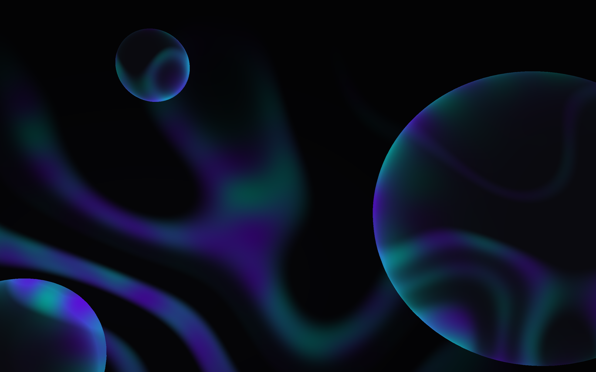

### 2. First hero: a plan before code

Before writing code, Claude proposed a design plan:

- **Colours:** taken from the shader itself (its cyan `#19D9BF` and violet `#7A3CFF`), so the text and the background read as one piece.
- **Type:** *Anybody*, a variable display face whose width can stretch, with *Geist* for body text.
- **Signature:** the word "flow" in the headline swells under the cursor, like the glass in the background.

Claude reviewed its own screenshots and fixed two bugs:

- The nav button text was invisible.
- The mobile menu opened underneath the headline.

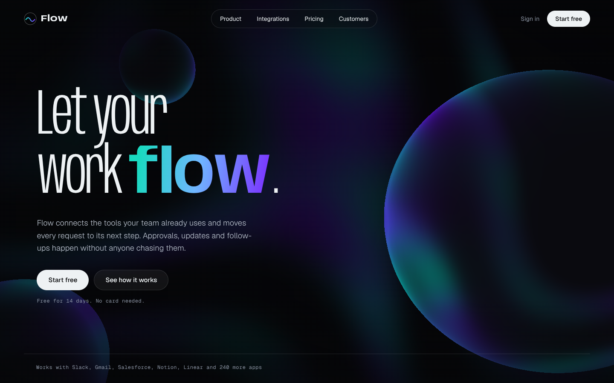
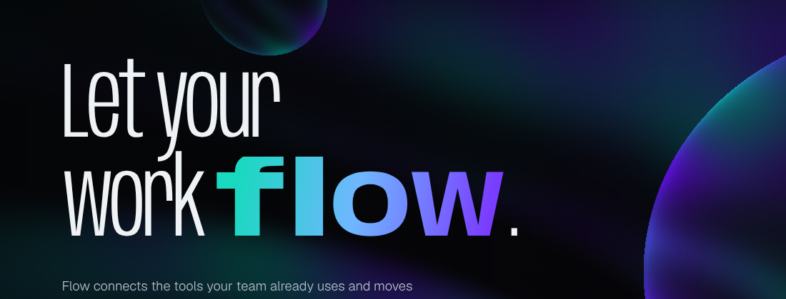

### 3. Exploring past the brief, then cutting back

I asked for a fully responsive page, and Claude read that as a full landing page: how it works, integrations, pricing, FAQ and a footer. The brief only asks for a hero, so I cut it back to the hero alone and put the effort into making that one screen work at every size: seven widths, from 2560px desktops down to sideways phones.

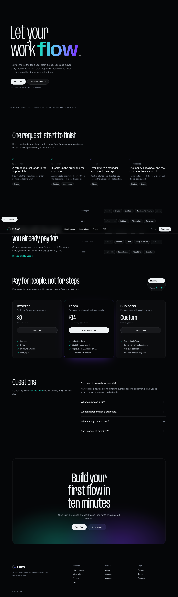

### 4. Catching a bug the AI's own test missed

Watching the live preview, I noticed the bubbles didn't react to the mouse.

- **Cause:** pointer events had been turned off on the whole hero (so text wouldn't block clicks), and the background inherited that setting, so it never saw the cursor.
- **Why the earlier test missed it:** it compared screenshots, and the background animates on its own, so the frames changed anyway.
- **Fix:** Claude wrote a stricter test (does the background actually receive the pointer?), watched it fail, fixed the bug, and watched it pass. The camera now follows the cursor, and the bubbles shift in depth.

| Cursor far left | Cursor far right |
|---|---|
| 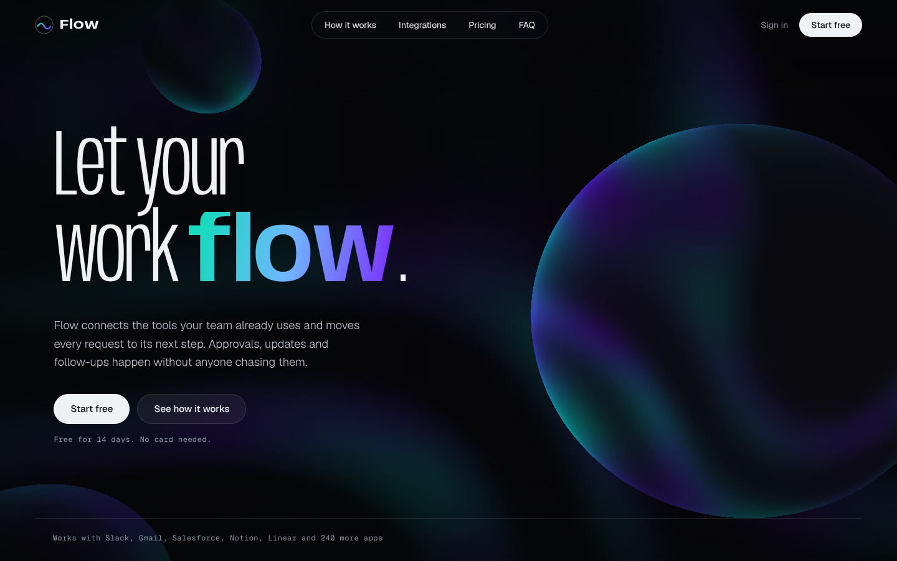 | 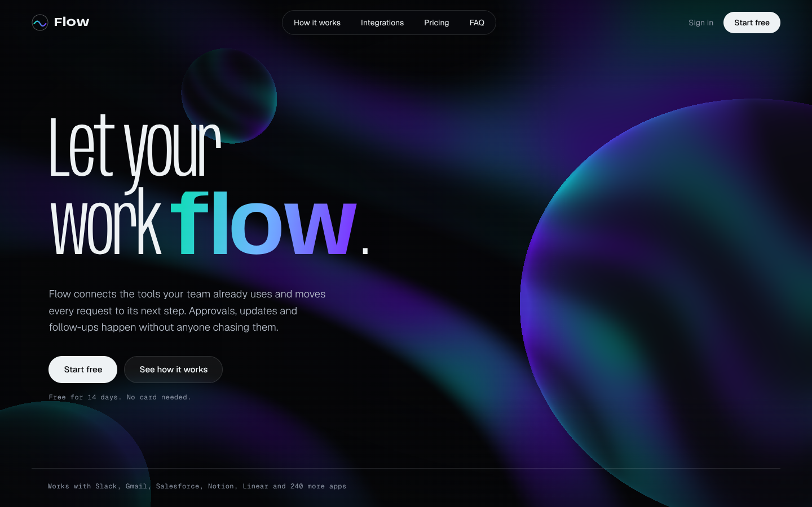 |

### 5. Checking the build against the brief

When I gave Claude the full brief, it compared the build against each requirement and found three gaps:

- It had made Flow an automation tool, but the brief says a productivity app. All copy was rewritten.
- The tagline wasn't on the page. It's now used word for word.
- The main button said "Start free". It's now **Get Started** everywhere (hero, nav and mobile menu).

Design call: "without the noise" argues for fewer elements, so we removed the "Works with Slack, Gmail…" line and cut the nav from four links to three. The tagline became the only supporting line, set larger.

### 6. Borrowing an idea from Butter: a logo that acts out its name

I studied [Butter](https://www.butter.video/). Its interface type is plain and quiet, and the wordmark is the one expressive element: a heavy, slanted brush script that melts when you hover it. I wanted Flow's logo to work the same way. It took three rounds:

1. **Wave through the letters.** Claude's first version kept Flow's geometric type, with a wave passing through the letters and the icon. I rejected it: it didn't have Butter's character.
2. **Brush script and a liquid drip.** I asked for Butter's typography and interaction.
   - Butter's logo is custom lettering, not a font, so Claude rendered ten free brush-script fonts side by side. It picked *Mr Dafoe* as the closest, thickened it with a thin outline, and dropped the circle icon, since Butter uses a wordmark alone.
   - The first hover distortion looked ragged rather than liquid, so it was changed to a downward drip.
3. **Letters connected by a drop.** I redirected again: each letter should flow into the next, connected by drops. The final logo works like this:
   - On hover, a cyan drop hops F → l → o → w and back.
   - Each letter lights up and gives slightly as the drop lands on it, then hands the light on.
   - A trailing droplet and a "goo" filter fuse into one stretching drop, so the letters read as joined by liquid.

Testing caught a real bug along the way. The browser's first frame can carry a timestamp slightly earlier than the start time, which made the first time step negative and crashed the animation. Time steps are now never allowed to go backwards.

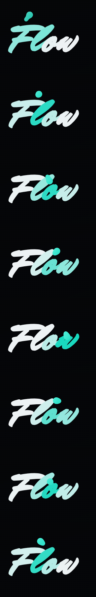

### 7. The headline and logo: finding the right motion and type

This took the most rounds, and most of the direction came from me.

1. **Liquid pour.** The first idea for the headline's "flow" treated each letter as a glass: liquid fills it and the letter expands, then the liquid pours into the next letter. I liked the animation, but the typeface (the narrow, wide-stretching *Anybody*) looked abstract.
2. **A detour.** I asked for a better treatment and described a drop making each letter. Claude read that as a request for a new animation and built a drop that writes the word in brush script. The script wasn't readable at headline size, and I preferred the pour.
3. **Bouncy vs flowing.** On the logo, I called out that the drop hopping between letters felt bouncy. It now glides F → w along one even path, each letter brightening as it passes.
4. **A better typeface for the pour.** The pour animation came back, first in *Fraunces* italic, a readable calligraphic serif.
5. **The logo's own hand.** I asked for the headline to use the logo's typeface and letter case, giving **Let Your Work Flow.** in title case.
6. **Balance.** Set entirely in script, the line felt heavy, so through a comment on the preview I asked for "Let Your Work" in something that balances "Flow". It became a light sans, and only **Flow** stayed in the logo's brush script. I also had the body copy under the headline removed.
7. **Final: an explored pairing.** I asked for a proper exploration of font pairing and spacing. Claude rendered six pairings with the script **Flow**: light sans, serif, serif italic, soft serif, extra-light sans, and small tracked capitals over a large script. The tracked capitals won.
   - **LET YOUR WORK** is set small in widely spaced Geist capitals, the way Butter sets its interface type, and **Flow** sits large beneath it in the logo's script, carrying the gradient and the pour.
   - The size gap does the pairing: one voice is quiet and upright, the other loud and slanted, so they never compete.
   - The spacing follows the type rather than fixed steps. The gap under the capitals is about a quarter of the script's size, because script ascenders rise that far above their line (a fixed gap let the F and l collide with the capitals).

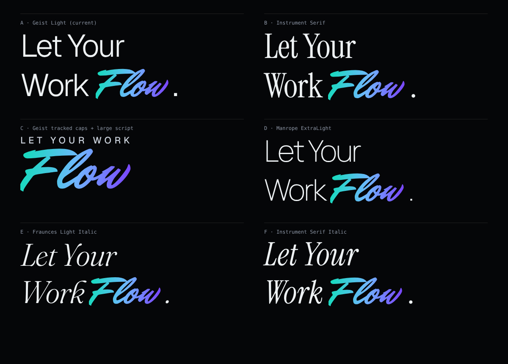

8. **Connected lettering.** Watching closely, I saw the script's letters break apart during the pour: each letter was a separate piece, and swelling them one by one pulled the joins open. **Flow** is now drawn as one piece of SVG lettering that can't come apart. Its box is fitted to the actual ink (the font reserves a lot of empty space above and below its letters, which had pushed the layout apart).
9. **Colour that follows the writing.** The liquid rose from the bottom of each letter; I asked for it to flow the way the word is written. A stream now enters at the tip of the F, runs into the l, through the o and out along the w, with a wavy edge slanted like the script, and drains away in the same direction. I also restored the tagline as the body copy under the name.
10. **Letters that move.** I asked for the letters themselves to flow while the colour passes. A distortion filter frayed the brush edges, so instead the word rides a baseline that rolls as a slow wave: the joined letters sway together and stay crisp.
11. **A hero that clears itself.** At my request, the tagline, buttons and note come forward while someone moves the cursor and recede after a short pause, leaving only the name over the moving background. They show first for a few seconds on arrival, never hide while a button has keyboard focus, and stay visible on touch screens. The background frame reports pointer movement to the page, since moves over a frame don't reach it otherwise. (Replaced in step 9.)

Lesson for my workflow: when I ask for a change to one thing (here, the typeface), I need to say explicitly what to keep (the animation). The AI otherwise tends to redo everything.

Bugs caught in testing:
- A crash where the first frame's timestamp came before the start time, making time run backwards.
- Letters cut off where the script's swashes reached past their box. Fixed in two parts:
  - each letter got room around it;
  - the gradient was extended past both ends of the word, because the F's lead-in and the w's tail swash beyond the word and had no colour behind them.

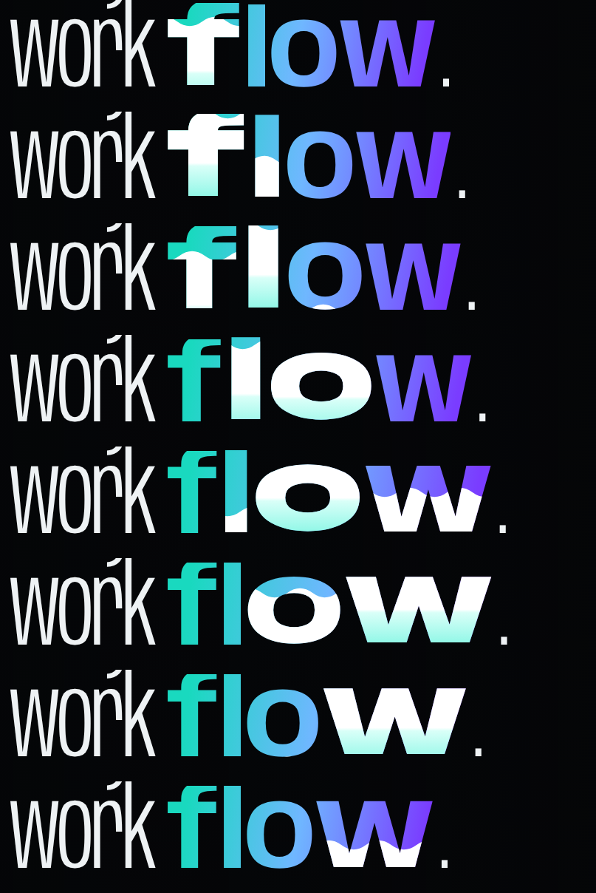

### 8. Liquid bubbles

I noticed the background bubbles were rigid: perfect spheres whose outlines stay clean arcs. I asked for them to flow and respond to the cursor.

- The ThreeUI source file stays untouched. A new component, `LiquidDimensionalField`, rewrites a copy of it when the page loads, the same way ThreeUI's own host adapts its documents.
- The bubbles' vertex shader now ripples their surface with slow crossing waves, so they are soft blobs.
- Near the cursor, the surface swells softly outward like liquid being drawn, then relaxes when the pointer rests.
- My first version pulled the surface *toward* the cursor, and I noticed it made the bubbles sharp: a crease formed where the cursor met an edge. Any movement aimed at the cursor's direction flips right at the cursor, so the swell now depends only on distance from it. That keeps the bubbles round and smooth while they react.
- Following my comments: a bubble near the cursor now drifts away from it, grows slightly and swells smoothly, then floats back. The background's light beams keep a dim floor, so the scene never empties out between passes.
- I then asked for the bubbles to look like real bubbles. Each one is now clear: it redraws the background behind it, bent through its curved surface like a lens, with a thin-film rainbow rim and a small highlight. The constant wobble was toned down so the outlines stay round arcs and settle back quickly after the cursor leaves.
- If the source ever changes and the hooks no longer match, it falls back to the original effect instead of breaking.

| At rest | Cursor near the right bubble |
|---|---|
| 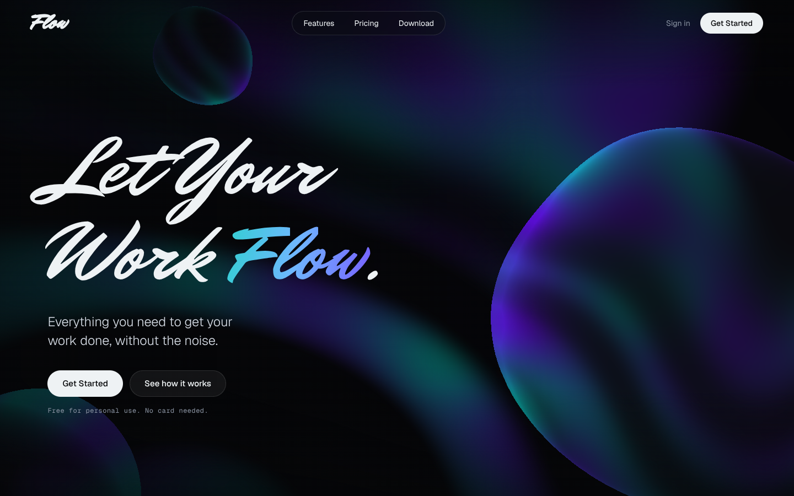 | 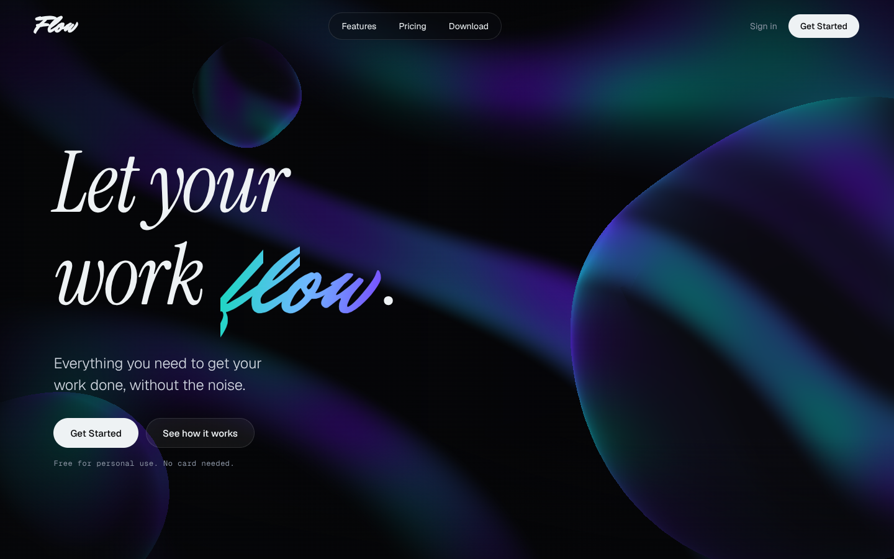 |

### 9. From noise to Flow: the page acts out its tagline

I wrote out the full sequence I wanted: the page opens loud, and the visitor's own movement calms it until the message is clear and Get Started is the obvious next step. It turns the tagline, "without the noise", into something the visitor does rather than reads.

- **On open (noise):** "Flow" and Get Started are clear from the first frame. The colour field churns and each bubble drifts on its own path. The body copy is in place but unresolved: an SVG refraction filter bends and softens it, as if seen through the bubbles.
- **As the cursor moves:** a single "order" value rises from 0 to 1 over about 2.4 seconds of movement and eases back if the visitor stops early. The page and the WebGL scene share it through `postMessage`.
- **What order changes:** the bubbles leave their separate paths and join one shared, slow current. The background turbulence and the bend through the bubbles both reduce, and the scene's clock slows by about half, so it calms without ever stopping. The copy's distortion and blur fade to nothing, and the filter is then removed entirely so the final text is pixel-sharp.
- **Final state (flow):** once the sentence is fully readable, order locks at 1. Get Started grows slightly and gains a soft glow, and the secondary button steps back, so the primary CTA is the strongest element on the page.
- **Access:** keyboard focus on a button, reduced-motion settings and touch screens (after a short pause) all go straight to the readable state, so no one has to perform a mouse gesture to read the copy.
- I removed the earlier "recede when idle" behaviour, since the new sequence replaces it: once the visitor has settled the page, it stays settled.
- The first browser test caught a bug: the scene's new state variables had not been injected into the iframe, so it threw an error every frame while the page side looked fine. After the fix the console was clean.

| On open: active, copy unresolved | After interaction: composed, copy clear, Get Started in focus |
|---|---|
| 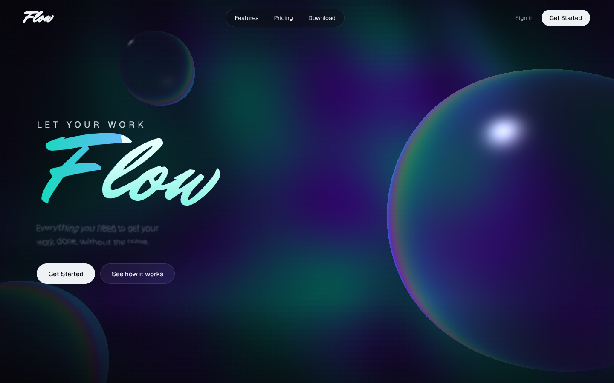 | 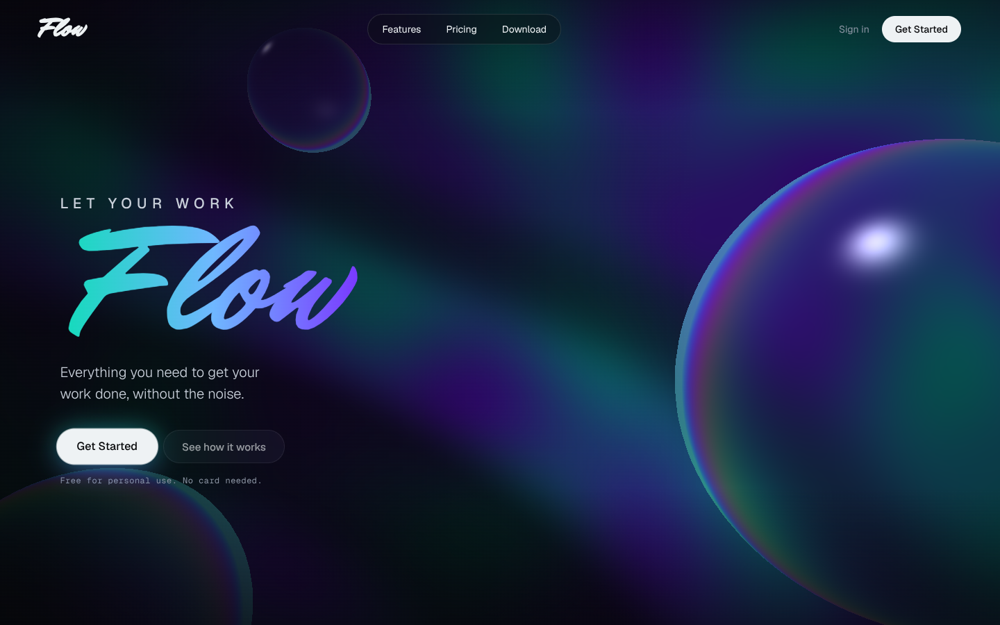 |

### 10. A second direction: the lens variant

To compare against the version above (left untouched), I asked for a variant that gives the motion a clearer meaning: fragmented movement → coordinated movement → clarity → calm. It runs on `lens.html` from the same components, through a `variant="lens"` option; the original page renders exactly as before.

- **Interaction begins at the bubble:** the scene's order gathers about four times faster when the cursor is near the main bubble than elsewhere, so the change reads as reaching for it rather than as any movement at all.
- **Clarity through a lens:** the sentence is held in two layers, one bent by the refraction filter and one clear. A glass oval, drawn like the bubbles with a thin-film rim, sweeps across from the bubble's side; the clear layer is revealed behind it. It is not a fade.
- **Calm:** the bubbles join one current and the field slows, as in the original; the lens fades out as the sweep ends and Get Started takes the focus.
- No new content was added: same copy, same CTA, no product features.

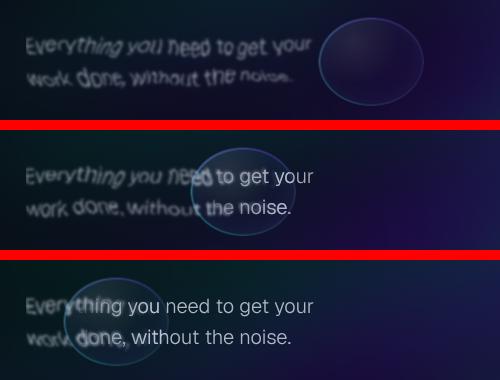

## Where I directed or corrected the AI

| AI output | My direction |
|---|---|
| Ready to approximate a missing effect | Required the exact ThreeUI source, checked against its published hashes |
| Expanded "responsive webpage" into a six-section landing page | Cut it to the hero only, matching the brief |
| Its test said the hover worked | Noticed it didn't in the live preview; the root cause was a CSS inheritance bug |
| Invented an automation product and its copy | Brought the copy back to the brief's productivity app, tagline and CTA |
| A headline in an abstract, wide-stretching typeface | Asked for a typeface that suits the name |
| Replaced the pour animation I liked with a new drop animation in an unreadable script | Asked for the original animation back, only in a better typeface |
| Set the headline in a different typeface from the logo | Asked for the logo's typeface and letter case in the headline, so the brand reads as one hand |
| Hops and squash in the logo animation | Called out the bouncy feel; the drop now glides |
| Rigid, perfectly round bubbles | Asked for liquid bubbles that flow toward the cursor |
| Bubbles that turned sharp when reacting to the cursor | Asked for flowing without losing smoothness |
| A headline set entirely in script, plus body copy | Asked for a balancing typeface for "Let Your Work", and removed the body copy |
| One pairing applied without comparison | Asked for an exploration of pairing and spacing; chose from six rendered options |
| Script letters that broke apart during the pour | Spotted the breakage; asked for connected letters |
| Colour rising from the bottom of each letter | Asked for it to flow F → l → o → w, the way the word is written |
| Beams that faded out entirely; bubbles that only swelled | Asked for a steady background and bubbles that drift and expand near the cursor |
| Opaque, lumpy bubbles | Asked for real refraction and round arcs that recover after interaction |
| Static lettering during the colour flow | Asked for the letters themselves to flow |
| Buttons and text always on screen | Asked for them to appear with interaction and recede when idle |
| A hero that looked the same before and after interaction | Wrote the full noise → Flow sequence: distorted copy that the visitor's movement resolves, ending on Get Started |
| A white logo beside a multicolour headline, then a logo coloured all the time | Asked for the headline's colours in the logo, but only on hover: it rests white and fills letter by letter, F to w, as the drop passes, then drains back to white |
| A plain white hover on Get Started | Asked for a minimal, balanced gradient highlight around it: a 1.5px ring of the Flow gradient with a faint halo, on hover and keyboard focus |
| A white inner outline on the focused Get Started, doubling up with the gradient ring | Asked for the stroke inside to go; only the gradient ring and soft glow remain |
| A static logo, then a wave effect in the original type | Pointed to Butter's melting brush wordmark as the reference, then redirected to letters connected by a drop |

## Reflection

> **Draft for me to rewrite in my own words before submitting.**
>
> AI did most of the build work: porting the ThreeUI background into a React app, proposing the colour and type system, writing the code, and screenshot-testing it at every screen size. My part was direction and judgement: choosing the Dimensional Field background, holding the AI to the exact source rather than an approximation, cutting a full landing page back to the hero the brief asked for, and catching that the background ignored the mouse even though the AI's own test said it worked. I also pulled the copy back to the brief after the AI invented a different product. With more time I would test whether the moving background competes with "without the noise" (for example a calmer, slower version), design the section that "See how it works" leads to, and run a quick five-second test with a few people to check that the headline and tagline land.
