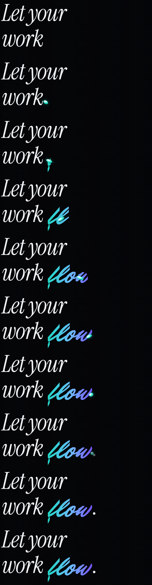

# Flow hero: AI workflow

UI/UX design intern assignment: a desktop landing page hero for **Flow**, a fictional productivity app.

- **Tagline (from the brief):** "Everything you need to get your work done, without the noise."
- **Primary CTA (from the brief):** Get Started
- **Tools:** Claude Code (a cloud session working directly in this repository), the ThreeUI *Dimensional Field* WebGL background, and Playwright screenshots so each iteration could be checked visually.

## Final result

| | |
|---|---|
| Final desktop hero |  |
| Same build on a phone |  |

- Run locally: `npm install`, then `npm run dev`.
- Main code: `src/components/FlowHero.tsx`, `src/components/FlowHero.css` and `src/components/SiteHeader.tsx`.

## How the work went, step by step

### 1. Choosing the background and getting its real source

I chose ThreeUI's **Dimensional Field**: glass spheres over slow cyan and violet light beams. I wanted the original effect, not a lookalike, so I gave Claude the source and told it not to approximate it.

- Claude first refused to rebuild the effect from a description and asked for the source.
- When the source link was blocked by the session's network settings, it stopped and reported that, rather than guessing.
- After I pasted the source, it checked each file against the SHA-256 hashes ThreeUI publishes:
  - The stylesheet matched exactly.
  - Two files didn't match, because whitespace was lost in the paste. Claude recorded this openly and added `npm run verify:sources` so any later change to these files is caught.

### 2. First hero: a plan before code

Before writing code, Claude proposed a design plan:

- **Colours:** taken from the shader itself (its cyan `#19D9BF` and violet `#7A3CFF`), so the text and the background read as one piece.
- **Type:** *Anybody*, a variable display face whose width can stretch, with *Geist* for body text.
- **Signature:** the word "flow" in the headline swells under the cursor, like the glass in the background.

Claude reviewed its own screenshots and fixed two bugs:

- The nav button text was invisible.
- The mobile menu opened underneath the headline.

### 3. Exploring past the brief, then cutting back

I asked for a fully responsive page, and Claude read that as a full landing page: how it works, integrations, pricing, FAQ and a footer. The brief only asks for a hero, so I cut it back to the hero alone and put the effort into making that one screen work at every size: seven widths, from 2560px desktops down to sideways phones.

### 4. Catching a bug the AI's own test missed

Watching the live preview, I noticed the bubbles didn't react to the mouse.

- **Cause:** pointer events had been turned off on the whole hero (so text wouldn't block clicks), and the background inherited that setting, so it never saw the cursor.
- **Why the earlier test missed it:** it compared screenshots, and the background animates on its own, so the frames changed anyway.
- **Fix:** Claude wrote a stricter test (does the background actually receive the pointer?), watched it fail, fixed the bug, and watched it pass. The camera now follows the cursor, and the bubbles shift in depth.

| Cursor far left | Cursor far right |
|---|---|
|  |  |

### 5. Checking the build against the brief

When I gave Claude the full brief, it compared the build against each requirement and found three gaps:

- It had made Flow an automation tool, but the brief says a productivity app. All copy was rewritten.
- The tagline wasn't on the page. It's now used word for word.
- The main button said "Start free". It's now **Get Started** everywhere (hero, nav and mobile menu).

Design call: "without the noise" argues for fewer elements, so we removed the "Works with Slack, Gmail…" line and cut the nav from four links to three. The tagline became the only supporting line, set larger.

### 6. Borrowing an idea from Butter: a logo that acts out its name

I studied [Butter](https://www.butter.video/). Its interface type is plain and quiet, and the wordmark is the one expressive element: a heavy, slanted brush script that melts when you hover it. I wanted Flow's logo to work the same way. It took three rounds:

1. **Wave through the letters.** Claude's first version kept Flow's geometric type, with a wave passing through the letters and the icon. I rejected it: it didn't have Butter's character.
2. **Brush script and a liquid drip.** I asked for Butter's typography and interaction.
   - Butter's logo is custom lettering, not a font, so Claude rendered ten free brush-script fonts side by side. It picked *Mr Dafoe* as the closest, thickened it with a thin outline, and dropped the circle icon, since Butter uses a wordmark alone.
   - The first hover distortion looked ragged rather than liquid, so it was changed to a downward drip.
3. **Letters connected by a drop.** I redirected again: each letter should flow into the next, connected by drops. The final logo works like this:
   - On hover, a cyan drop hops F → l → o → w and back.
   - Each letter lights up and gives slightly as the drop lands on it, then hands the light on.
   - A trailing droplet and a "goo" filter fuse into one stretching drop, so the letters read as joined by liquid.

Testing caught a real bug along the way. The browser's first frame can carry a timestamp slightly earlier than the start time, which made the first time step negative and crashed the animation. Time steps are now never allowed to go backwards.

### 7. The headline and logo: from bouncy to flowing

The headline "flow" first only swelled under the cursor. My first ask for a passing highlight produced liquid filling each letter, which I rejected: it looked abstract and didn't show *flow*. I described what I wanted instead: the F starts, a drop runs off it and makes the L, and so on.

The next version did that with hops: a drop arcing from letter to letter, squashing on landing, letters springing into place. It worked, but I pointed out that it, and the logo, felt bouncy rather than flowing. That led to one motion language for the whole hero, **a current, not a bounce**:

- **Headline:** one stream writes the word. A drop glides in after "work", each letter of *flow* is revealed as it passes over it, and at the end the drop slows, shrinks and settles as the full stop. Nothing overshoots.
- **Logo:** the drop glides F → w along one low, even path, each letter brightening as it passes. There's no hopping and no squash.
- **Typeface:** "Let your work" moved from the narrow *Anybody* to *Instrument Serif* italic. Its calligraphic curves run on into the brush-script *flow*, which matches the logo.

Testing caught a crash along the way: the browser's first animation frame can be stamped slightly before the start time, which made time run backwards. Time steps are now never allowed to go negative.

### 8. Liquid bubbles

I noticed the background bubbles were rigid: perfect spheres whose outlines stay clean arcs. I asked for them to flow and respond to the cursor.

- The ThreeUI source file stays untouched. A new component, `LiquidDimensionalField`, rewrites a copy of it when the page loads, the same way ThreeUI's own host adapts its documents.
- The bubbles' vertex shader now ripples their surface with slow crossing waves, so they are soft blobs.
- Near the cursor, the surface swells and stretches toward it like liquid being drawn, then relaxes when the pointer rests.
- If the source ever changes and the hooks no longer match, it falls back to the original effect instead of breaking.

| At rest | Cursor near the right bubble |
|---|---|
|  |  |

## Where I directed or corrected the AI

| AI output | My direction |
|---|---|
| Ready to approximate a missing effect | Required the exact ThreeUI source, checked against its published hashes |
| Expanded "responsive webpage" into a six-section landing page | Cut it to the hero only, matching the brief |
| Its test said the hover worked | Noticed it didn't in the live preview; the root cause was a CSS inheritance bug |
| Invented an automation product and its copy | Brought the copy back to the brief's productivity app, tagline and CTA |
| A headline word that only reacted to the cursor, then liquid filling each letter | Rejected the fill as abstract; described the F making the L with a drop |
| Hops, squash and springy overshoot in both logo and headline | Called out the bouncy feel; everything became one gliding current |
| Rigid, perfectly round bubbles | Asked for liquid bubbles that flow toward the cursor |
| A static logo, then a wave effect in the original type | Pointed to Butter's melting brush wordmark as the reference, then redirected to letters connected by a drop |

## Reflection

> **Draft for me to rewrite in my own words before submitting.**
>
> AI did most of the build work: porting the ThreeUI background into a React app, proposing the colour and type system, writing the code, and screenshot-testing it at every screen size. My part was direction and judgement: choosing the Dimensional Field background, holding the AI to the exact source rather than an approximation, cutting a full landing page back to the hero the brief asked for, and catching that the background ignored the mouse even though the AI's own test said it worked. I also pulled the copy back to the brief after the AI invented a different product. With more time I would test whether the moving background competes with "without the noise" (for example a calmer, slower version), design the section that "See how it works" leads to, and run a quick five-second test with a few people to check that the headline and tagline land.
